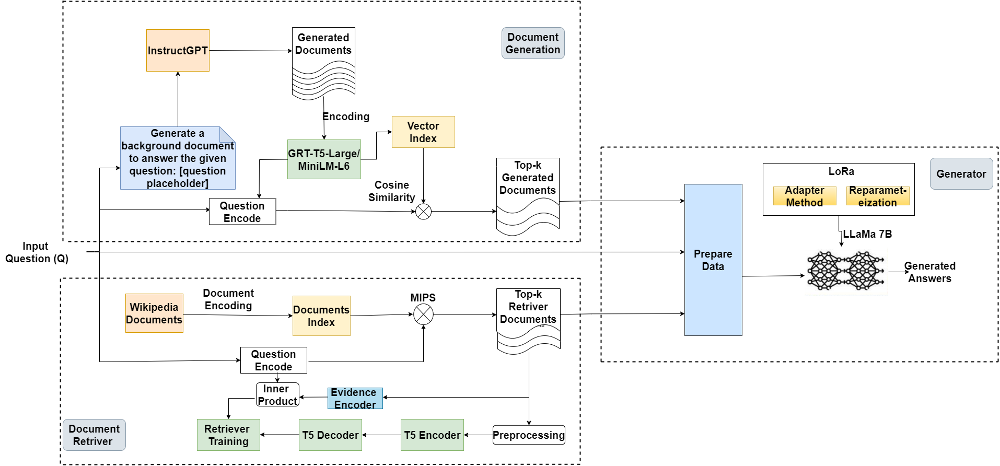
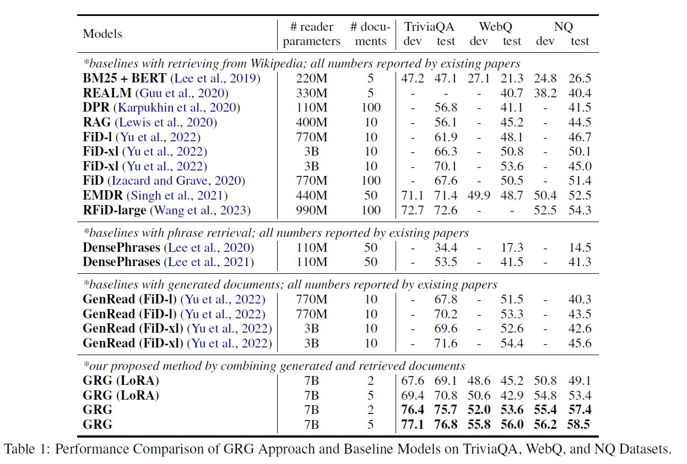

<a id="contents"></a>
# Contents
<!-- MarkdownTOC -->
<!--
- [Requirements](#Requirements)
- [Downloading Data and Checkpoints](#downloading-data-and-checkpoints)
- [Usage](#usage)
- [Training](#training)-->
- [Citation](#Citation)
<!-- /MarkdownTOC -->


[GRG](https://arxiv.org/abs/2307.11278) Generator-Retriever-Generator: A Novel Approach to Open-domain Question Answering. 

**GRG approach**
<p align="center">
  
</p>

**Comparison with other approaches**
<p align="center">
  
</p>
<a id="Requirements"></a>
# Requirements

<a id="Citation"></a>
# Citation

If you find these codes or data useful, please consider citing our paper as:

```
@article{abdallah2023generator,
  title={Generator-Retriever-Generator: A Novel Approach to Open-domain Question Answering},
  author={Abdallah, Abdelrahman and Jatowt, Adam},
  journal={arXiv preprint arXiv:2307.11278},
  year={2023}
}
```

